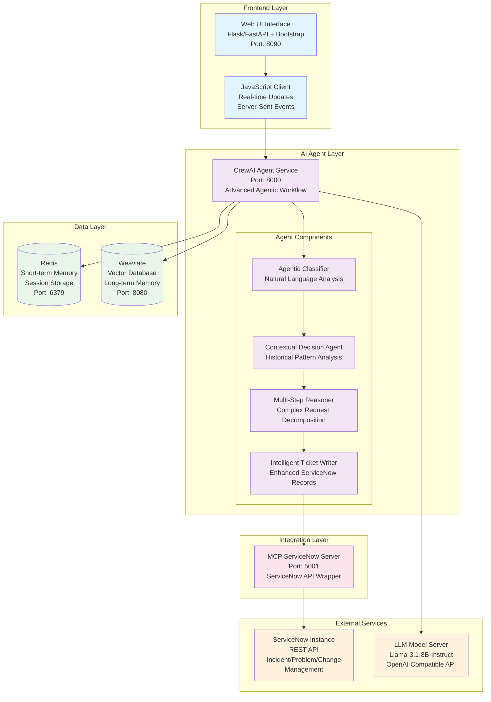
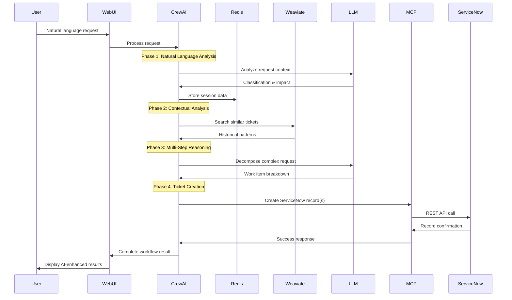

# ServiceNow Agent Architecture Documentation

## System Overview

**IncidentOpsAI** is an advanced agentic AI system designed for intelligent ServiceNow ticket management. The system leverages sophisticated natural language processing, contextual decision-making, and multi-step reasoning to automate the creation and management of ServiceNow records.

---

## 🏗️ Architecture Diagram



---

## 🧠 Agentic Workflow Diagram

```mermaid
graph TB
    START([User Natural Language Request])
    
    subgraph "Phase 1: Natural Language Analysis"
        P1[Agentic Classifier Agent]
        P1A[Business Impact Assessment]
        P1B[Technical Domain Classification]
        P1C[Urgency Detection from Language]
        P1D[Stakeholder Identification]
    end
    
    subgraph "Phase 2: Contextual Decision-Making"
        P2[Contextual Decision Agent]
        P2A[Vector Similarity Search<br/>Historical Tickets]
        P2B[Duplicate Risk Assessment]
        P2C[Assignment Optimization<br/>Based on Success Patterns]
        P2D[Resolution Pattern Analysis]
    end
    
    subgraph "Phase 3: Multi-Step Reasoning"
        P3[Multi-Step Reasoner Agent]
        P3A[Chain-of-Thought<br/>Request Decomposition]
        P3B[Dependency Mapping<br/>Between Work Items]
        P3C[Parallel vs Sequential<br/>Work Identification]
        P3D[Cross-Domain Analysis]
    end
    
    subgraph "Phase 4: Intelligent Ticket Creation"
        P4[Intelligent Ticket Writer]
        P4A[Context-Aware Ticket Generation]
        P4B[Business Justification<br/>Integration]
        P4C[Historical Insight<br/>Enrichment]
        P4D[Success Criteria Definition]
    end
    
    subgraph "Execution Layer"
        SINGLE{Single Ticket<br/>Required?}
        MULTI[Multiple Work Items<br/>Creation & Sequencing]
        API[ServiceNow API<br/>Record Creation]
    end
    
    RESULT([ServiceNow Records<br/>Created with AI Intelligence])
    
    %% Flow connections
    START --> P1
    P1 --> P1A
    P1A --> P1B
    P1B --> P1C
    P1C --> P1D
    P1D --> P2
    
    P2 --> P2A
    P2A --> P2B
    P2B --> P2C
    P2C --> P2D
    P2D --> P3
    
    P3 --> P3A
    P3A --> P3B
    P3B --> P3C
    P3C --> P3D
    P3D --> P4
    
    P4 --> P4A
    P4A --> P4B
    P4B --> P4C
    P4C --> P4D
    P4D --> SINGLE
    
    SINGLE -->|Yes| API
    SINGLE -->|No| MULTI
    MULTI --> API
    API --> RESULT
    
    %% Styling
    classDef phase1 fill:#e3f2fd
    classDef phase2 fill:#e8f5e8
    classDef phase3 fill:#fff3e0
    classDef phase4 fill:#fce4ec
    classDef execution fill:#f3e5f5
    classDef decision fill:#ffecb3
    
    class P1,P1A,P1B,P1C,P1D phase1
    class P2,P2A,P2B,P2C,P2D phase2
    class P3,P3A,P3B,P3C,P3D phase3
    class P4,P4A,P4B,P4C,P4D phase4
    class API,MULTI execution
    class SINGLE decision
```



---

## 🔧 Component Details

### 1. Web UI Interface (`web-ui/`)
**Technology**: Flask/FastAPI + Bootstrap + JavaScript
**Port**: 8090
**Responsibilities**:
- User interface for natural language input
- Real-time status updates via Server-Sent Events
- Result visualization with AI analysis details
- Fallback processing when agents unavailable

**Key Files**:
- `app.py` - Flask application with async task management
- `static/app.js` - Frontend JavaScript with real-time updates
- `templates/index.html` - Bootstrap-based responsive UI

### 2. CrewAI Agent Service (`crewai-agent/`)
**Technology**: FastAPI + CrewAI + Advanced NLP
**Port**: 8000
**Responsibilities**:
- Advanced natural language understanding
- Sophisticated business context analysis
- Multi-agent coordination and workflow orchestration
- Vector-based contextual decision making

**Key Files**:
- `src/main.py` - Main agentic workflow engine (1000+ lines)
- `src/config/agents.yaml` - Agent definitions and capabilities
- `src/config/tasks.yaml` - Task definitions and workflow phases

**Agent Components**:
1. **Agentic Classifier**: Natural language to structured action
2. **Contextual Decision Agent**: Historical analysis and recommendations
3. **Multi-Step Reasoner**: Complex request decomposition
4. **Intelligent Ticket Writer**: Enhanced ServiceNow record generation

### 3. MCP ServiceNow Server (`mcp_servicenow/`)
**Technology**: FastAPI + ServiceNow REST API
**Port**: 5001
**Responsibilities**:
- ServiceNow API integration and authentication
- Record type-specific payload formatting
- Error handling and connection management
- Support for incidents, problems, changes, CIs, knowledge articles

**Key Files**:
- `server.py` - FastAPI service with ServiceNow integration

**Supported Record Types**:
- Incidents (`/mcp/servicenow/create_incident`)
- Problems (`/mcp/servicenow/create_problem`)
- Changes (`/mcp/servicenow/create_change`)
- Configuration Items (`/mcp/servicenow/create_ci`)
- Knowledge Articles (`/mcp/servicenow/create_knowledge`)
- Generic Records (`/mcp/servicenow/create_record`)

### 4. Data Layer

#### Redis (Port: 6379)
**Purpose**: Short-term memory and session management
- User session history storage
- Temporary workflow state
- Caching for performance optimization

#### Weaviate (Port: 8080)  
**Purpose**: Vector database for contextual intelligence
- Historical ticket similarity search
- Pattern recognition and learning
- Contextual decision-making support
- Knowledge base for organizational memory

### 5. External Services

#### LLM Model Server
**Model**: Llama-3.1-8B-Instruct
**Interface**: OpenAI-compatible API
**Usage**:
- Natural language analysis and classification
- Business impact assessment
- Technical scope determination
- Multi-step reasoning and decomposition

#### ServiceNow Instance
**Interface**: REST API with basic authentication
**Tables Supported**:
- `incident` - Service disruptions and issues
- `problem` - Root cause analysis records
- `change_request` - Planned modifications
- `cmdb_ci` - Configuration items
- `kb_knowledge` - Knowledge articles
- `sc_request` - Service requests

---

## 🔄 Agentic Workflow Phases

### Phase 1: Natural Language to Structured Action
**Agent**: Agentic Classifier
**Purpose**: Transform vague user requests into precise ServiceNow classifications

**Capabilities**:
- **Business Impact Assessment**: Analyzes language cues to determine business impact
- **Urgency Detection**: Identifies emotional language and time-sensitive indicators
- **Technical Domain Classification**: Maps requests to technical domains and skills
- **Stakeholder Identification**: Determines affected users and teams
- **Priority Recommendation**: Data-driven priority assessment with reasoning

**Example Input**: *"VPN login is failing for all users, looks urgent"*
**Example Output**:
```json
{
  "classification": "INCIDENT",
  "business_impact": "All remote workers cannot access company resources",
  "recommended_priority": 1,
  "urgency_factors": "Widespread impact, business continuity risk",
  "stakeholders": ["remote_workers", "it_support", "management"]
}
```

### Phase 2: Contextual Decision-Making
**Agent**: Contextual Decision Agent
**Purpose**: Leverage organizational knowledge for intelligent recommendations

**Capabilities**:
- **Vector-based Similarity Search**: Find similar historical tickets using Weaviate
- **Duplicate Detection**: Prevent redundant work by identifying existing tickets
- **Assignment Optimization**: Recommend teams based on historical success patterns
- **Resolution Pattern Analysis**: Learn from past successful resolutions
- **Organizational Memory Integration**: Apply institutional knowledge

**Example Processing**:
- Searches for similar "VPN login" issues in vector database
- Identifies that Network Operations team resolved similar issues fastest
- Detects potential duplicate with open ticket #INC001234
- Recommends escalation based on "all users" impact pattern

### Phase 3: Multi-Step Reasoning  
**Agent**: Multi-Step Reasoner
**Purpose**: Decompose complex requests into manageable work items

**Capabilities**:
- **Chain-of-Thought Decomposition**: Break requests into logical components
- **Dependency Mapping**: Identify prerequisite relationships
- **Parallel vs Sequential Work**: Optimize work scheduling
- **Cross-Domain Request Handling**: Manage requests spanning multiple technical domains
- **Work Item Prioritization**: Sequence work based on business impact

**Example Input**: *"Need new MacBook for new dev joining next week. Also his email isn't working yet."*
**Example Decomposition**:
1. **Hardware Procurement** (MacBook) - Priority 3, Assignment: Procurement
2. **Email Troubleshooting** - Priority 2, Assignment: IT Support  
3. **User Onboarding Setup** - Priority 3, Dependencies: [1,2]

### Phase 4: Intelligent Ticket Creation
**Agent**: Intelligent Ticket Writer
**Purpose**: Generate comprehensive ServiceNow tickets with rich context

**Capabilities**:
- **Context-Aware Generation**: Include business justification and technical details
- **Historical Insight Integration**: Add relevant patterns from similar tickets
- **Success Criteria Definition**: Specify measurable completion indicators
- **Stakeholder Communication**: Generate key messages for affected parties
- **Enhanced Metadata**: Add AI-enhanced fields for tracking and analysis

**Enhanced Ticket Fields**:
- Standard ServiceNow fields (priority, category, description)
- Business justification with impact analysis
- Recommended resolution approach from historical data
- Success criteria and acceptance conditions
- AI workflow metadata for tracking intelligence applied

---

## 🚀 Key Features & Innovations

### 1. **Sophisticated Natural Language Understanding**
- Goes beyond simple keyword matching
- Understands business context and emotional language
- Identifies implicit requirements and stakeholder needs
- Assesses technical complexity from description

### 2. **Contextual Intelligence**
- Vector-based similarity search using Weaviate
- Organizational memory and pattern recognition  
- Duplicate prevention with risk assessment
- Assignment optimization based on historical success

### 3. **Multi-Agent Coordination**
- Four specialized agents working in sequence
- Each agent has specific domain expertise
- Coordinated workflow with handoff between agents
- Robust error handling and fallback mechanisms

### 4. **Advanced Request Decomposition**
- Chain-of-thought reasoning for complex requests
- Automatic dependency identification
- Parallel work optimization
- Cross-domain request handling

### 5. **Enhanced ServiceNow Integration**
- Support for multiple record types
- Intelligent field mapping and validation
- Business context enrichment
- AI-enhanced metadata for tracking

---

## 📊 Data Flow



---

## 🛠️ Development & Deployment

### Docker Compose Architecture
The system is containerized for easy deployment:

```yaml
services:
  redis: # Short-term memory
  weaviate: # Vector database  
  mcp_servicenow: # ServiceNow integration
  crewai-agent: # AI workflow engine
  web-ui: # User interface
```

### Environment Configuration
Required environment variables:
- `SN_INSTANCE`: ServiceNow instance URL
- `SN_USER`: ServiceNow API user
- `SN_PASS`: ServiceNow API password  
- `MODEL_URL`: LLM model server endpoint
- `MODEL_TOKEN`: LLM API authentication token
- `REDIS_URL`: Redis connection string
- `WEAVIATE_URL`: Weaviate instance URL

### Testing Framework
Comprehensive test suite (`test_agentic_workflow.py`):
- Natural language analysis validation
- Multi-step reasoning verification
- Contextual decision-making tests
- End-to-end workflow validation

---

## 🎯 Business Value

### 1. **Automation of Complex Decision-Making**
- Reduces human effort in ticket classification
- Improves consistency in priority assessment
- Accelerates incident response times

### 2. **Organizational Learning**  
- Captures and applies institutional knowledge
- Learns from historical resolution patterns
- Prevents duplicate work and effort

### 3. **Enhanced User Experience**
- Natural language interface - no training required
- Real-time progress updates and transparency
- Intelligent recommendations and guidance

### 4. **Scalable Architecture**
- Containerized deployment for easy scaling
- Microservices architecture for maintainability
- Vector database for growing organizational knowledge

---

## 🔮 Future Enhancements

1. **Advanced Analytics Dashboard**
2. **Multi-language Support**  
3. **Integration with Additional ITSM Platforms**
4. **Predictive Analytics for Incident Prevention**
5. **Advanced Workflow Automation**
6. **Integration with Communication Platforms (Slack, Teams)**

---

*This architecture demonstrates the power of combining advanced AI agents with practical business workflows to create intelligent, context-aware automation that truly understands and serves organizational needs.*
